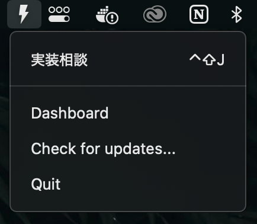
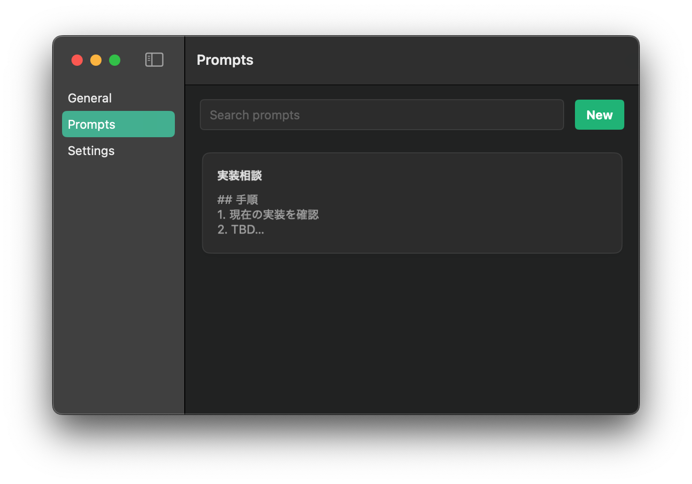

# PromptBolt ⚡

AI プロンプトを効率的に管理し、グローバルキーボードショートカットで瞬時にアクセスできる macOS メニューバーアプリケーションです。

## ✨ 主な機能

- 🖱️ **メニューバー統合**: メニューバーに常駐し、いつでも素早くアクセス
- ⌨️ **グローバルショートカット**: カスタムキーボードショートカットでプロンプトを瞬時に貼り付け
- 📝 **プロンプト管理**: AI プロンプトをタイトルと説明付きで整理・管理
- 🔄 **自動アップデート**: Sparkle フレームワークによるシームレスなアップデート

## 📸 スクリーンショット

### メニューバー表示

### プロンプト管理画面

## 🚀 インストール方法

### リリースページからダウンロード
1. [リリースページ](https://github.com/sakaguchi-0725/PromptBolt/releases)にアクセス
2. 最新の `PromptBolt.dmg` ファイルをダウンロード
3. DMG を開き、PromptBolt をアプリケーションフォルダにドラッグ
4. アプリケーションまたは Spotlight から PromptBolt を起動

### システム要件
- macOS 14.0 以降
- Apple Developer ID 署名済みアプリケーション（公証済み）
